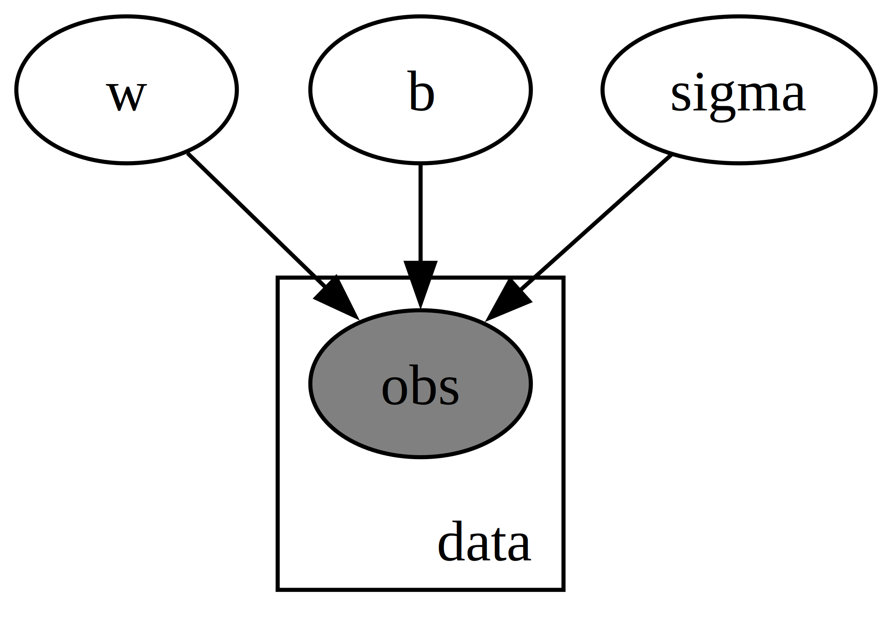
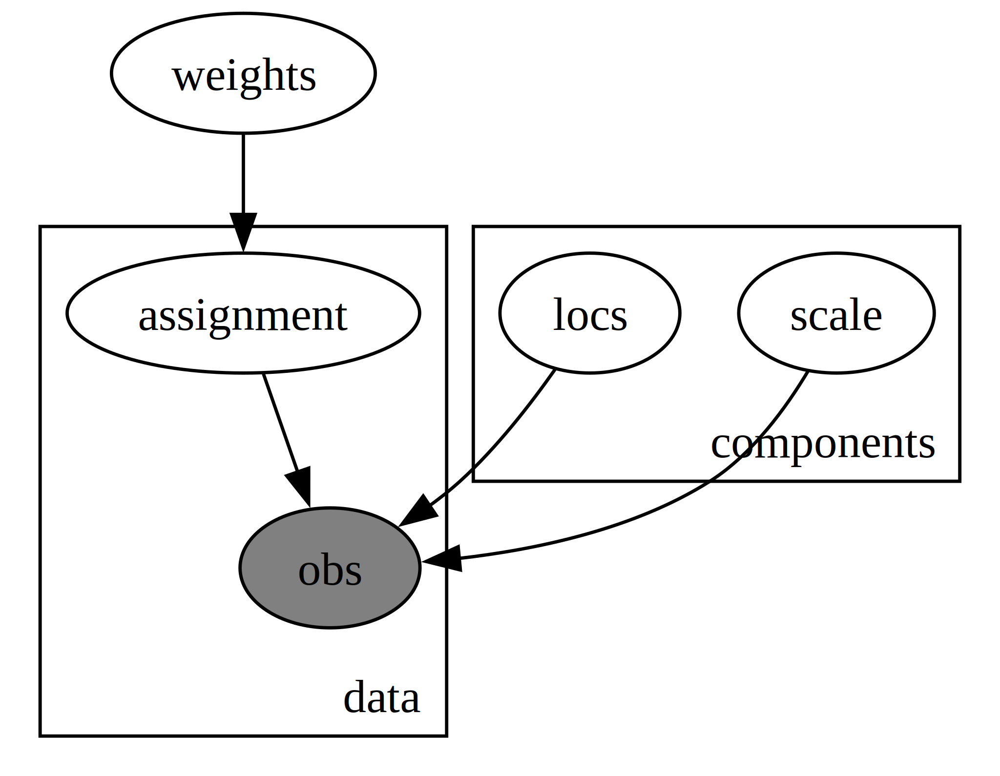

# probabilistic-ml
A repository containing various probabilistic machine learning models starting from the simplest to the most complex.

## Bayesian Regression
The first model implemented. Takes some randomly generated correlated points and attempts to a find a line for which the points are most probably generated. There are two versions of this, the first is data that comes from syntheic line data and the other one is a students t distribution that is supposed to be used to detect outliers such as students who cheated on an exam or students who underperformed despite studying heavily. I recently started to update these to only use MCMC and NUTS

## Gaussian Mixture Model
Assuming that our data was generated from many different gaussians, we can treat this sort of like a clustering problem. The difference between this model and a classical KMM classifier is that we will also know how confident the model is with its clustering. I updated this model again recently to explore the entire posterior distribution using Markov Chain Monte Carlo (MCMC) approximation and the No U-Turn Sampler (NUTS). I found it to be very useful to set informative priors using K-Means. Although they were neververy close to the true means they got in the ballpark and MCMC fine tuned it. 

## Gamma Mixture Model
The same as the model from before except we are sample from a more homogenous distribution. It works far more accurately than I expected and uses MCMC and NUTS

## Bayesian Neural Network
WIP

## Variational Autoencoder
WIP

## Hidden Markov Model
This is a classic example that tries to learn the weather from the observed activity of an individual on particular days. 